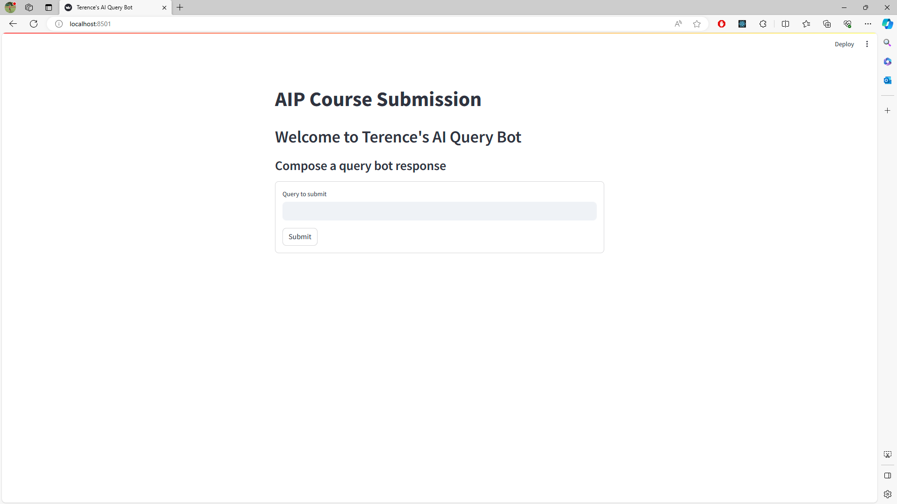

<!-- Tempalate README.md extracted from https://github.com/othneildrew/Best-README-Template/tree/master -->

<a name="readme-top"></a>

<!-- PROJECT LOGO -->
<br />
<div align="center">
  <h3 align="center">Red Dragon AI In Production Course Project Submission</h3>

  <p align="center">
    A simple LLM model deployment using Streamlit, FastAPI and Docker
  </p>
</div>

<!-- TABLE OF CONTENTS -->
<details>
  <summary>Table of Contents</summary>
  <ol>
    <li>
      <a href="#about-the-project">About The Project</a>
      <ul>
        <li><a href="#built-with">Built With</a></li>
      </ul>
    </li>
    <li>
      <a href="#getting-started">Getting Started</a>
      <ul>
        <li><a href="#prerequisites">Prerequisites</a></li>
        <li><a href="#installation">Installation</a></li>
      </ul>
    </li>
    <li><a href="#usage">Usage</a></li>
    <li><a href="#acknowledgments">Acknowledgments</a></li>
  </ol>
</details>

<!-- ABOUT THE PROJECT -->

## About The Project




This project generates a response from a pretrained LLM model based on a query.

<p align="right">(<a href="#readme-top">back to top</a>)</p>

### Built With

- [![Streamlit][Streamlit]][Streamlit-url]
- [![FastAPI][FastAPI]][FastAPI-url]
- [![Docker][Docker]][Docker-url]
- [TinyLlama/TinyLlama-1.1B-Chat-v1.0](https://huggingface.co/TinyLlama/TinyLlama-1.1B-Chat-v1.0)

<p align="right">(<a href="#readme-top">back to top</a>)</p>

<!-- GETTING STARTED -->

## Getting Started

To get a local copy up and running follow these simple example steps.

### Prerequisites

You need to have Docker installed and running.

### Installation

1. Clone the repo:
   ```sh
   git clone https://github.com/IamRENCE/personal-site.git
   ```
2. Build the docker image:
   ```sh
   docker compose build
   ```

<p align="right">(<a href="#readme-top">back to top</a>)</p>

<!-- USAGE EXAMPLES -->

## Usage

1. Build docker image
   ```sh
   docker compose up -d
   ```
2. Go to `localhost:8501` to use the app.

<p align="right">(<a href="#readme-top">back to top</a>)</p>

<!-- ACKNOWLEDGMENTS -->

## Acknowledgments

Use this space to list resources you find helpful and would like to give credit to. I've included a few of my favorites to kick things off!

- [Red Dragon AI Pte Ltd](https://reddragonai.com/)
  - [Martin Andrews](mailto:martin@reddragon.ai)
  - [Sam Witteveen](mailto:martin@reddragon.ai)

<p align="right">(<a href="#readme-top">back to top</a>)</p>

<!-- MARKDOWN LINKS & IMAGES -->
<!-- https://www.markdownguide.org/basic-syntax/#reference-style-links -->

[Streamlit]: https://img.shields.io/badge/streamlit-black?logo=streamlit
[Streamlit-url]: https://streamlit.io/
[FastAPI]: https://img.shields.io/badge/fastapi-black?logo=fastapi
[FastAPI-url]: https://fastapi.tiangolo.com/
[Docker]: https://img.shields.io/badge/docker-black?logo=docker
[Docker-url]: https://www.docker.com/
